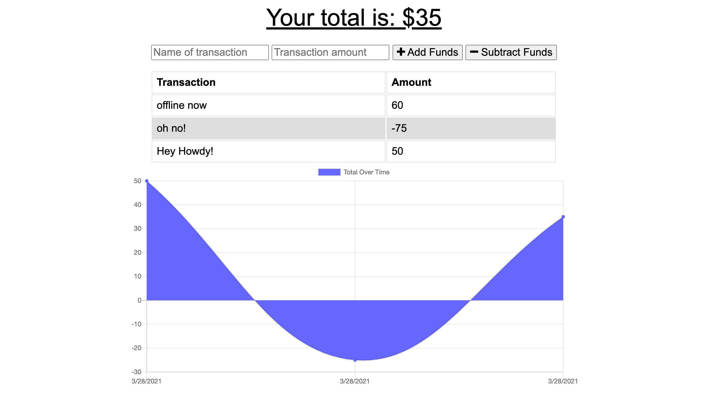

# Budget Tracker

This application, a straightforward budget tracker, was developed by Joseph Cosgrove to practice using service workers. The application allows the user to update a budget with titled transactions that positively and negatively affect their budget. If changes are made while offline or in bad connection, then the app will update as soon as a network connection is detected. The following technologies were utilized:

- HTML
- CSS
- Node.JS
- JavaScript
- Express
- MongoDB and mongoose
- IndexedDB
- Git and Github
- Heroku (for deployment)

The offline functionality of the app was developed using a service worker to cache critical files, and IndexedDB to interact with a client-side database that interacts with the server-side DB hosted on MongoDB Atlas. A manifest.json file stores basic information about the app that will display on the user's GI when downloaded. 

The deployed application can be located at: https://cosgrove-offline-budget.herokuapp.com/

Joseph can be contacted with questions at jcosgrovecoding@gmail.com